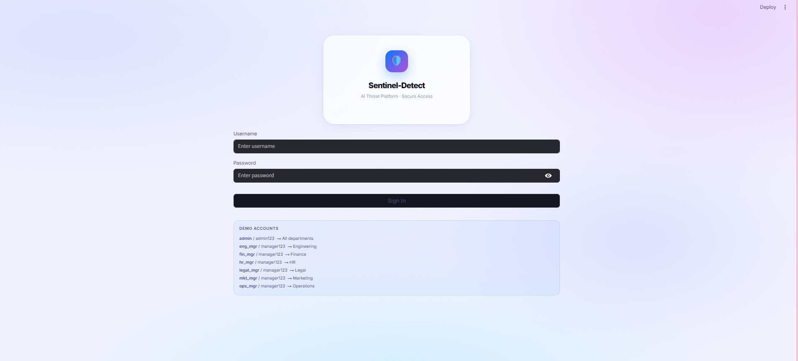
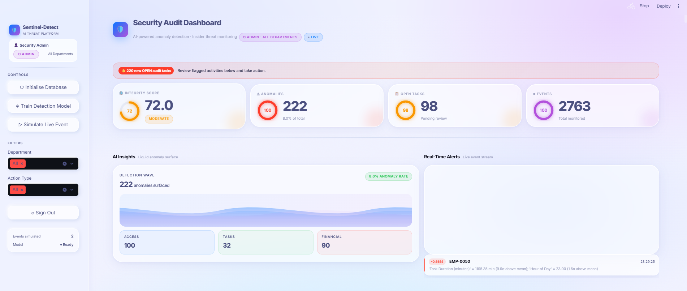
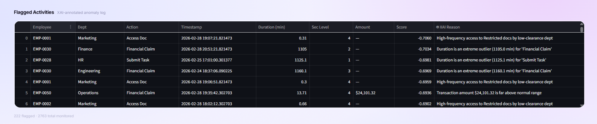
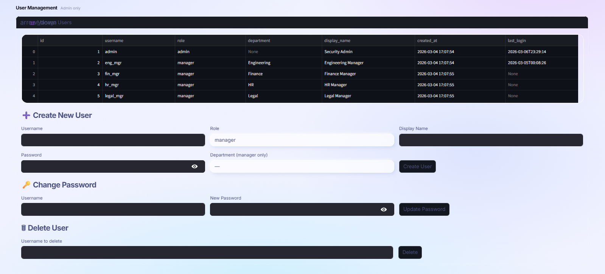
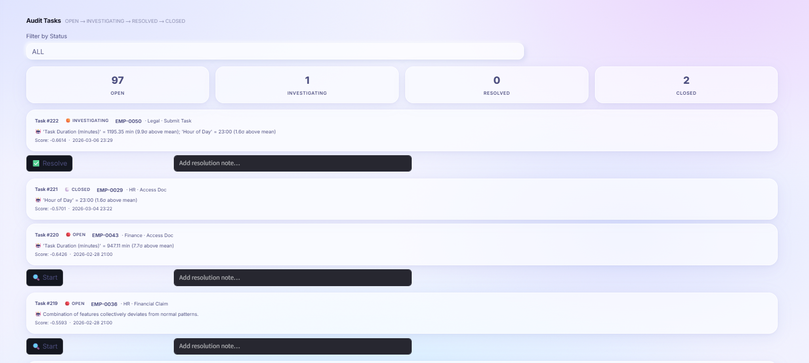

# 🛡️ Sentinel-Detect

> **AI-powered Insider Threat Detection Platform** — Real-time employee behaviour anomaly detection with explainable AI, full CRUD management, and a production-ready Docker deployment. Built for resource-constrained environments (runs on 8 GB RAM, free to deploy).



---

## ✨ Features

| Feature | Description |
|---|---|
| 🔍 **Real-time Scoring** | Isolation Forest anomaly detection on live event streams |
| 🧠 **Explainable AI (XAI)** | Per-prediction z-score deviation explanation for each anomaly |
| 📊 **5-Page Dashboard** | Dashboard · Alert Review · Employee CRUD · History · System |
| ✅ **Alert Workflow** | Whitelist false positives or Confirm Fraud with one click |
| 👥 **Employee CRUD** | Create, edit, deactivate employees — no code changes needed |
| 📈 **Historical Trends** | 30-day integrity score and anomaly breakdown charts |
| ⚡ **FastAPI Backend** | Separated ML scoring API with `/health`, `/score`, `/alerts` |
| 💾 **SQLite + WAL** | Concurrent-safe database with generator-based memory-efficient reads |
| 🪵 **Loguru Logging** | Structured logs with auto-rotation (10 MB / 14-day retention) |
| 🐳 **Docker Ready** | Multi-stage build < 350 MB · RAM-capped at 1 GB total |

---

## 📸 Screenshots

### 1. Dashboard Overview (KPI + Liquid Wave + Charts+ alert)


### 2. XAI


### 3. Employee CRUD Management


### 4. Audit Tasks


---

## 🏗️ Architecture

```
┌──────────────────────────────────────────────────────┐
│                  Sentinel-Detect v2                  │
│                                                      │
│  ┌─────────────────┐  HTTP   ┌──────────────────┐   │
│  │  Streamlit UI   │────────▶│  FastAPI         │   │
│  │  :8501          │         │  /health         │   │
│  │                 │         │  /score/event    │   │
│  │  📊 Dashboard   │         │  /score/batch    │   │
│  │  🔍 Alerts      │◀────────│  /alerts         │   │
│  │  👥 Employees   │         │  /stats          │   │
│  │  📈 History     │         │  :8000           │   │
│  │  ⚙️  System      │         └────────┬─────────┘   │
│  └─────────────────┘                  │              │
│                              ┌────────▼─────────┐   │
│                              │  SQLite (WAL)    │   │
│                              │  employees       │   │
│                              │  activity_logs   │   │
│                              │  alert_logs      │   │
│                              │  daily_stats     │   │
│                              └──────────────────┘   │
└──────────────────────────────────────────────────────┘
```

---

## 🚀 Quick Start

### Option 1 — Local

```bash
git clone https://github.com/Punyisa-m/Sentinel-Detect.git
cd sentinel-detect

pip install -r requirements.txt

# Terminal 1: FastAPI backend
uvicorn api:app --host 0.0.0.0 --port 8000 --workers 1

# Terminal 2: Streamlit dashboard
streamlit run dashboard.py
```

Open → http://localhost:8501

### Option 2 — Docker (Recommended)

```bash
# Build once, shared image, both services
docker compose up --build -d

# Monitor RAM
docker stats

# Logs
docker compose logs -f api
```

| Service | URL | RAM Limit |
|---|---|---|
| Streamlit UI | http://localhost:8501 | 400 MB |
| FastAPI + Docs | http://localhost:8000/docs | 600 MB |
| **Total** | | **≤ 1 GB** ✓ |

---

## 📁 Project Structure

```
sentinel-detect/
├── api.py                       # FastAPI — /health /score /alerts /stats
├── dashboard.py                 # Streamlit — 5-page UI (Dashboard/Alerts/Employees/History/System)
├── auth.py                      # PBKDF2-SHA256 authentication + RBAC (admin/manager)
├── data_generator.py            # Synthetic logs, anomaly injection, feature engineering
├── model_engine.py              # Isolation Forest training, XAI explainer, batch scoring
├── requirements.txt             # Python dependencies
├── Dockerfile                   # Multi-stage build on python:3.11-slim (< 350 MB)
├── docker-compose.yml           # API + UI shared image, RAM-limited to 1 GB total
├── .gitignore
├── docs/
│   └── screenshots/            
│       ├── banner.png
│       ├── 01-dashboard.png
│       ├── 02-XAI.png
│       ├── 03-Audit Tasks.png
│       └── 04-User Management.png
│
│   ── Auto-generated (git-ignored) ──
├── sentinel.db                  # SQLite database
├── sentinel_model.joblib        # Trained Isolation Forest
├── sentinel_scaler.joblib       # Feature scaler
├── sentinel_feature_stats.joblib# Feature stats for XAI z-score computation
└── logs/
    └── sentinel_api.log         # Auto-rotated (10 MB / 14 days)
```

---

## 🧠 ML Pipeline

```
Raw Logs → Feature Engineering (6 features) → Isolation Forest → XAI Explanation → Alert Log
```

| Feature | What it detects |
|---|---|
| `freq_score` | Burst access patterns → credential theft |
| `duration_minutes` | Near-zero = automation, extreme = abandonment |
| `security_level` | Privilege escalation (1=Public → 4=Restricted) |
| `transaction_amount` | Financial fraud outliers |
| `hour_of_day` | After-hours exfiltration |
| `action_encoded` | Behavioural drift from user baseline |

**Model:** `IsolationForest(n_estimators=200, contamination=0.08)`  
**Threshold:** score < −0.10 triggers audit alert  
**XAI output:** *"Task Duration = 0.02 min (18.3σ below mean)"*

---

## 🔌 API Reference

| Method | Endpoint | Description |
|---|---|---|
| `GET` | `/health` | System status, RAM, model state |
| `POST` | `/score/event` | Score + persist + auto-create alert |
| `POST` | `/score/batch` | Memory-efficient bulk scoring |
| `GET` | `/alerts` | Paginated alerts with status filter |
| `PATCH` | `/alerts/{id}/review` | Whitelist / Confirm Fraud / Close |
| `GET` | `/stats/kpis` | Live KPI summary |
| `GET` | `/stats/daily` | 30-day historical stats |

Interactive docs → http://localhost:8000/docs

---

## ☁️ Free Deployment

### Streamlit Community Cloud
```bash
# 1. Push to GitHub
git push

# 2. https://share.streamlit.io → New app → select repo → Deploy ✓
```

### Hugging Face Spaces
```bash
cp dashboard.py app.py   # HF requires app.py as entry point
git push                 # to your HF Space repo
```

### FastAPI on Railway (free 500 hrs/month)
```bash
npm install -g @railway/cli
railway login && railway init && railway up
```

---

## ⚙️ Environment Variables

| Variable | Default | Description |
|---|---|---|
| `API_BASE` | `http://localhost:8000` | FastAPI endpoint |

`.streamlit/secrets.toml`:
```toml
API_BASE = "https://your-api.railway.app"
```

---

## 🛠️ Tech Stack


---

## 🗺️ Roadmap

- [ ] JWT authentication for API
- [ ] WebSocket real-time alert push
- [ ] LLM-generated investigation report (Claude / GPT-4o)
- [ ] Slack / LINE notification on CONFIRMED_FRAUD
- [ ] Export alert log to PDF report

---

## 📄 License

MIT — free for personal and commercial use.

---

<div align="center">
  Built with ❤️ &nbsp;·&nbsp; Python 3.11 &nbsp;·&nbsp; Free to deploy &nbsp;·&nbsp; 8 GB RAM friendly
</div>